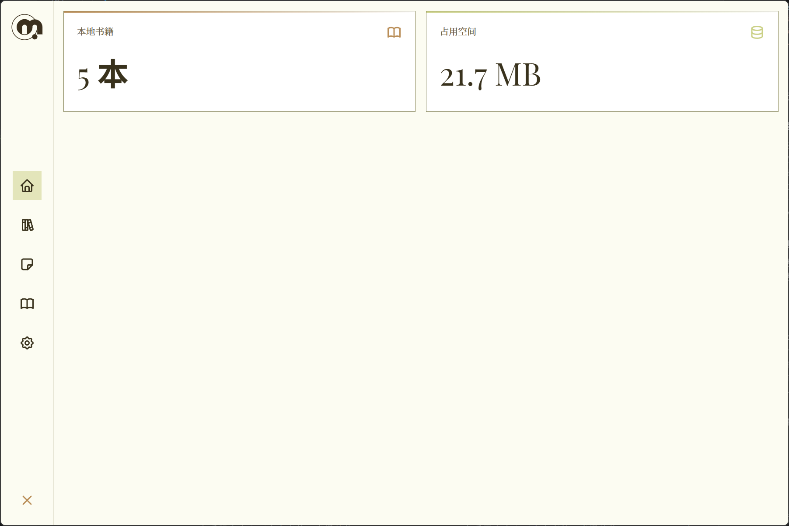
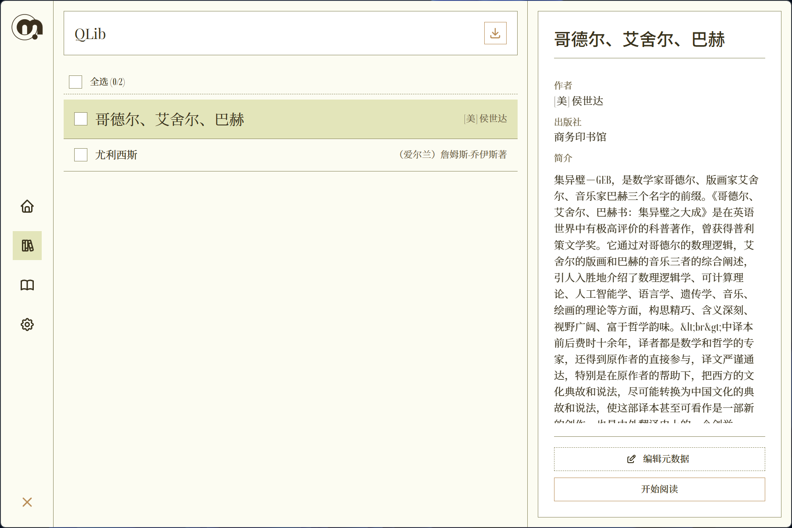
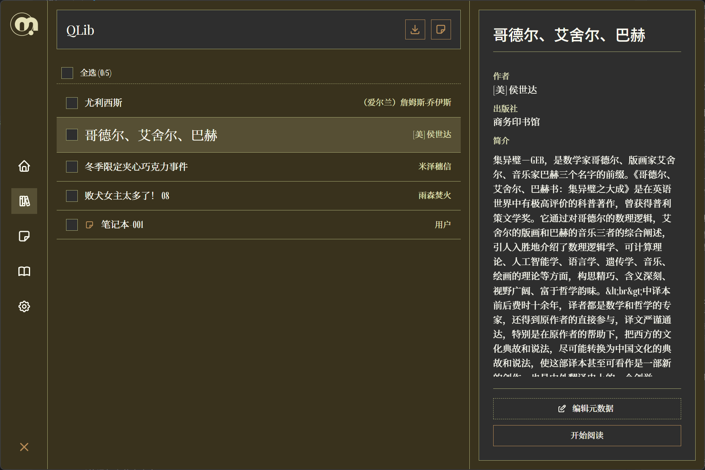
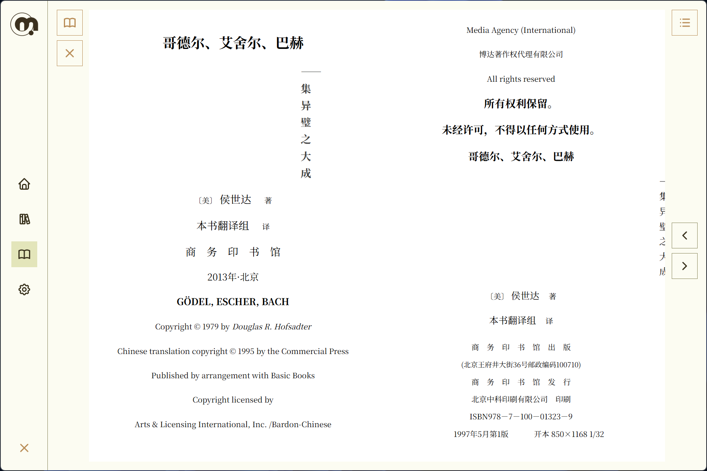
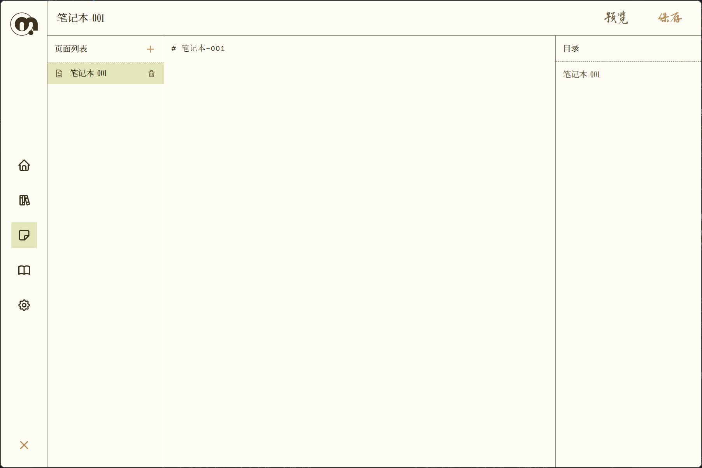
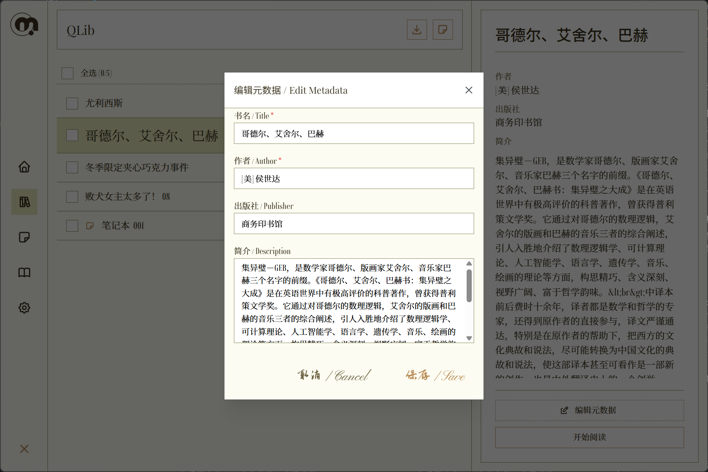

# 奇墨 (Qimo) - 优雅的 EPUB 电子书阅读器

<div align="center">
  
  <br />
</div>

**奇墨 (Qimo)** 是一款基于 Tauri 2.0 开发的跨平台桌面端 EPUB 电子书阅读器。它融合了复古自然的视觉设计与现代高效的阅读体验，致力于为用户提供一个纯净、隐私且高度可定制的本地阅读空间。

## 功能特性

- **智能书库管理**：支持多书库路径配置与一键切换，自动提取 EPUB 元数据（封面、作者、出版社及简介），让书籍整理井井有条。
- **沉浸式阅读体验**：基于 `epub.js` 深度定制，支持目录快速跳转、阅读进度自动记忆、窗口自适应布局以及独立的阅读器样式配置。
- **内置笔记系统**：支持创建和管理 Markdown 格式的阅读笔记，页面化管理，实时预览，同步至 EPUB 文件，打造完整的知识管理体系。
- **标签管理**：为书籍添加自定义标签，支持按标签筛选，快速整理和查找书籍。
- **复古自然美学**：独特的"复古自然"主题设计，精选 Playfair Display、Rondal、智芒行书等多款优雅字体，配合细腻的噪点纹理背景，还原纸质书阅读质感。
- **个性化设置**：提供明暗主题无缝切换、中英文双语界面支持，以及针对阅读器的专属字体与字号调整。
- **本地化隐私保护**：所有数据均存储在本地 SQLite 数据库，不上传任何用户信息，确保您的阅读记录绝对安全。

## 应用截图

### 主页


### 书库（亮色主题）


### 书库（暗色主题）


### 阅读器


### 笔记编辑器


### 元数据编辑


## 技术栈

- **后端**：Rust (Tauri 2.0, quick-xml, zip, rusqlite)
- **前端**：React 19, TypeScript, Vite
- **UI 框架**：Mantine UI, UnoCSS
- **核心引擎**：epub.js
- **数据库**：SQLite (本地存储)

---

## 快速开始

### 环境要求

- Windows 10/11 (需要 Visual Studio Build Tools with C++ workload)
- macOS 或 Linux
- 建议分辨率：1280x720 及以上

### 安装方式

#### 1. 下载预编译版本

请访问项目的 [Releases 页面](https://github.com/your-repo/qimo-library/releases) 下载对应操作系统的安装包。

#### 2. 从源码构建

如果您希望参与开发或体验最新功能，可以通过以下步骤从源码运行：

```bash
# 克隆仓库
git clone https://github.com/your-repo/qimo-library.git
cd qimo-library

# 安装依赖
npm install

# 启动开发模式
npm run tauri dev
```

### 首次启动向导

首次打开应用时，系统将引导您选择一个文件夹作为**默认书库**。建议选择专用的空文件夹，以便奇墨更好地管理您的电子书文件。

---

## 使用教程

### 导入书籍

1. 进入**书库**页面。
2. 点击右上角的 **导入书籍** 按钮（或通过菜单栏选择）。
3. 在弹出的文件选择框中选中 `.epub` 格式文件，系统将自动解析并生成封面。

### 管理标签

1. 在书库页面选中一本书籍。
2. 点击右侧的**标签**按钮打开标签管理面板。
3. 输入新标签名称并按回车添加，或从已有标签库中选择。

### 创建笔记

1. 在书库页面点击 **新建笔记** 按钮。
2. 输入笔记名称，系统将自动生成标准 EPUB 格式的笔记文件。
3. 点击笔记即可进入编辑器，开始编写您的阅读心得或知识总结。

### 笔记编辑

- **页面管理**：左侧显示所有笔记页面，可添加新页面或删除已有页面。
- **Markdown 编辑**：中间区域支持 Markdown 语法编辑，实时渲染预览。
- **目录导航**：右侧自动生成标题目录，点击即可快速跳转。
- **自动保存**：每 3 秒自动保存一次，也可手动点击保存按钮。
- **同步至 EPUB**：所有内容同步保存至 EPUB 文件，方便备份与分享。

### 阅读操作

- **翻页**：点击屏幕两侧的翻页按钮，或使用键盘左右方向键。
- **目录导航**：点击右侧的目录图标，可快速跳转至指定章节。
- **进度保存**：系统会自动记录您的阅读位置，下次打开同一本书时将自动恢复。
- **外部书籍**：在阅读页点击左上角的"打开外部书籍"按钮，可直接预览未导入书库的 EPUB 文件。

### 元数据编辑

若自动提取的信息有误，您可以在书库详情页点击 **编辑元数据**，手动修正书名、作者、出版社或补充内容简介。

### 多书库管理

在 **设置** 页面的"书库"选项卡中，您可以添加多个书库路径（如"小说库"、"专业书"等），并通过勾选激活不同的书库进行分类管理。

---

## 数据存储

奇墨使用 SQLite 数据库存储以下信息：

- 书籍元数据（标题、作者、出版社等）
- 阅读进度和历史
- 书籍标签
- 笔记内容（同步至 EPUB 文件）
- 应用设置

数据库文件位于应用数据目录下：
- Windows: `%APPDATA%\com.qimo.library\`
- macOS: `~/Library/Application Support/com.qimo.library/`
- Linux: `~/.config/com.qimo.library/`

---

## 致谢与开源声明

奇墨 (Qimo) 的开发离不开以下优秀的开源项目与字体资源：

### 项目授权

本项目代码采用 **Apache License 2.0** 协议开源。

### 字体授权

本项目使用的字体均遵循其原始开源许可证（主要为 **SIL Open Font License 1.1**）：

- **Playfair Display**: 由 Claus Eggers Sorensen 设计，优雅的衬线字体。
- **Pinyon Script**: 由 Sorkin Type 设计，流畅的手写体。
- **Courier Prime**: 由 Quote-Unquote Apps 设计，经典的等宽字体。
- **思源宋体 (Source Han Serif SC)**: 由 Adobe 与 Google 联合开发，高质量中文宋体。
- **思源黑体 (Source Han Sans SC)**: 由 Adobe 与 Google 联合开发，高质量中文黑体。
- **Rondal**: 免费可商用字体，圆润的无衬线字体。
- **霞鹜文楷 (LXGW WenKai)**: 由 LXGW 开发，基于 Klee One 的开源中文字体，适合正文阅读。
- **智芒行书 (Zhimang Xing)**: 优美的中文行书字体，用于装饰性文本。

详细字体授权信息请参见 [public/Fonts/FONT_LICENSES.txt](public/Fonts/FONT_LICENSES.txt)。

### 核心依赖

- **[Tauri](https://tauri.app/)**: 构建更小、更快、更安全的桌面应用。
- **[epub.js](https://github.com/futurepress/epub.js/)**: 强大的网页端 EPUB 渲染引擎。
- **[Mantine UI](https://mantine.dev/)**: 功能丰富且可定制的 React 组件库。
- **[rusqlite](https://github.com/rusqlite/rusqlite)**: Rust 的 SQLite 封装库。

---

*Made by VKyuXr*
